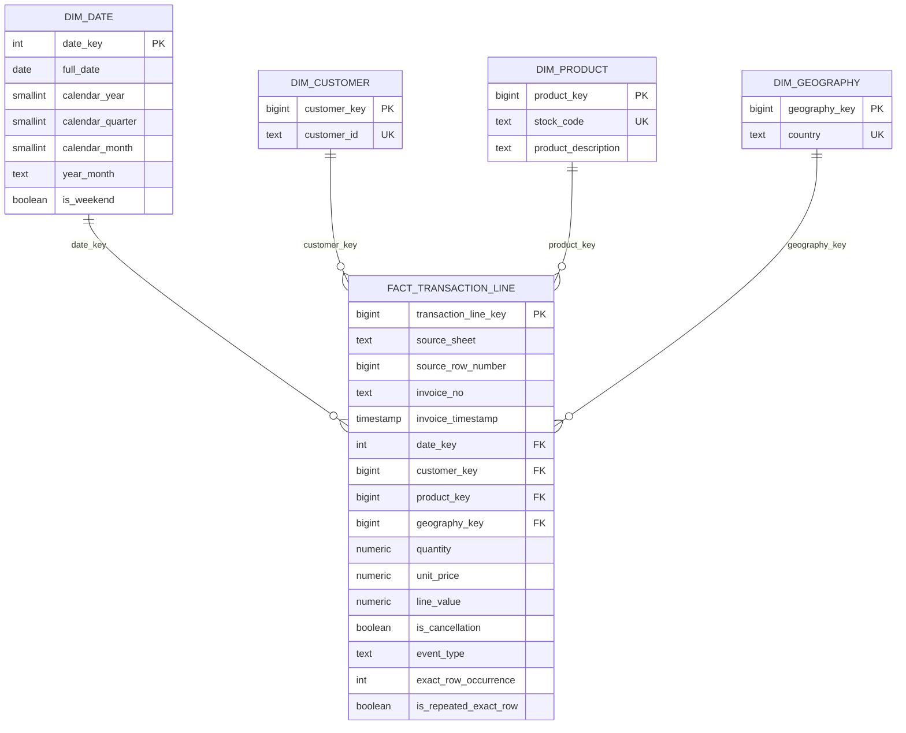

# Warehouse model

RetailIQ uses PostgreSQL as a reviewable analytical warehouse between the normalised Parquet layer and Power BI.

## Model



## Fact grain

`core.fact_transaction_line` has the same grain as the published source: **one workbook transaction line**. The pair `(source_sheet, source_row_number)` is unique and is carried from ingestion into the warehouse so every fact row can be traced back to its source location.

The fact table is intentionally row-preserving. It does not silently discard rows with missing customer IDs, cancellation records, zero prices, negative quantities or duplicate-looking content.

## Event classification

Each source line is classified as one of three event types:

| Event | Rule | Commercial use |
|---|---|---|
| `sale` | not flagged as a cancellation, quantity > 0, unit price > 0 | gross sales, orders, units, customer activity |
| `cancellation` | invoice is cancellation-coded or quantity < 0 | reported separately and deducted from gross sales in the net-sales mart |
| `non_revenue` | remaining rows | retained for audit/data-quality analysis; excluded from sales KPIs |

This classification is deliberately explicit because the source contains non-standard records that should not be hidden in ad-hoc dashboard filters.

## Duplicate policy

Rows with identical business fields receive an `exact_row_occurrence` using a deterministic window function. Occurrences after the first are flagged as `is_repeated_exact_row = true`.

They are **not automatically removed**. The public dataset does not provide enough provenance to prove that every exact repeated line is an ingestion error rather than a legitimate repeated invoice line. RetailIQ therefore exposes duplicate sensitivity as a data-quality issue instead of rewriting history without evidence.

## Dimension policy

### Date

A complete daily calendar is generated between the minimum and maximum transaction dates. This gives Power BI continuous time filtering rather than relying only on transaction dates.

### Customer

Only non-null source customer IDs become customer dimension members. Transactions without customer IDs remain in the fact table with a null `customer_key`; they can contribute to transaction-level sales reporting but cannot support customer retention analysis.

### Product

`stock_code` is the natural product key. Where multiple descriptions occur for the same stock code, the most recent non-empty description is selected for the dimension while the source staging data remains untouched.

### Geography

Country is modelled separately to avoid repeating descriptive geography values through the semantic model.

## Commercial marts

The SQL layer currently exposes:

- `mart.daily_commercial_performance`
- `mart.customer_summary`
- `mart.customer_rfm`
- `mart.customer_cohort_retention`
- `mart.product_performance`
- `mart.country_performance`
- `mart.data_quality_summary`
- `mart.reconciliation_summary`

These are intended to become the stable Power BI reporting interface rather than connecting the dashboard directly to staging tables.

## Reconciliation gate

A warehouse build is considered successful only when:

```text
staging row count = fact row count
staging SUM(line_value) = fact SUM(line_value)
```

`retailiq warehouse-build` checks both conditions after the star schema and marts are built and raises an error if either fails.

This check validates **row/value preservation**, not the business meaning of every source record. Commercial KPI rules remain separately documented in the KPI dictionary.
